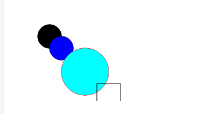
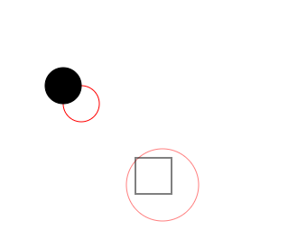

# 从零打造Echarts —— V2 属性更新和样式解析
本文开始v2版本（直到`xrender`初步完成为止，标题均指`xrender`的版本和特性）。
## 回顾V1
在上个版本中，我们实现了`zrender`官方文档首页的代码示例。不过还有一些问题等待我们解决。
## 样式规则
运行之前的代码可以看到其结果如下。



- 没有指定填充颜色的图形会被填充为黑色，描边同理。就我个人理解而言，对于一个图形，通常需要默认描边，而填充则不需要。
- 需要更多的样式规则应用，如透明度，线宽。

回到`XElement.ts`中，显然随着样式越来越复杂，需要将样式处理抽离为一个函数。
```typescript
/**
 * 将指定样式绑定到上下文中
 */
function bindStyle (ctx: CanvasRenderingContext2D, style: XElementStyle) {
  let fill = style.fill || 'transparent'
  ctx.fillStyle = fill
  ctx.strokeStyle = style.stroke
  ctx.globalAlpha = style.opacity
  ctx.lineWidth = style.lineWidth
}
```
然后在之前的`beforeRender`中应用即可。之后可以看到没有指定填充的图形不再有填充（更多的样式则需要依次处理，后面用到了再添加）。
## ~~高倍屏~~
~~但是看着看着就觉得有什么不对，怎么这么模糊呢？这牵扯到设备独立像素和绘制像素等东西，和图片在高倍屏下的问题是一样的，不明白的可以自行搜索。解决方式和`1px`边框类似，找到渲染倍率，绘制的时候数据乘以这个倍率，然后将画布缩放为一倍大小即可。~~
## 添加元素后重绘频率
在之前的代码中，如果连续调用`add`，会连续触发`render`，这种情况下应该将其合并为一次。使用防抖函数，很容易做到这一点。

在`util.ts`中添加防抖函数。
```typescript
export function debounce (fn: Function, delay = 300) {
  let timer = null
  return function (...args) {
    clearTimeout(timer)
    timer = setTimeout(() => {
      fn(...args)
    }, delay)
  }
}
```
问题是要在哪里加入防抖？是`XRender`中，还是`Painter中`？我暂时决定加入到`Painter`，间隔控制在一帧`16ms`。修改`Painter.render`
```typescript
class Painter {
  render = debounce(() => {
    let xelements = this.stage.getAll()
    for (let i = 0; i < xelements.length; i += 1) {
      xelements[i].refresh(this.ctx)
    }
  }, 16)
}
```
## 层级
在之前的代码中，如果两个图形有区域重合，后添加的图形会覆盖之前的图形，而实际使用中往往需要指定图形在最上层，只需要引入层级`zLevel`即可做到这一点。编辑`XElement.ts`。
```typescript
export interface XElementOptions {
  /**
   * 元素所处层级
   */
  zLevel?: number
}
class XElement {
  updateOptions () {
    // ...
    // 不考虑它为0
    if (opt.zLevel) {
      this.zLevel = opt.zLevel
    }
  }
}
```
然后在`Stage.getAll`中对所有元素进行排序。
```typescript
class Stage {
  /**
   * 获取所有元素
   */
  getAll () {
    this.updateXElements()

    return this.xelements
  }
  updateXElements () {
    // zLevel高的在后，其它按加入次序排列
    this.xelements.sort((a, b) => {
      return a.zLevel - b.zLevel
    })
  }
}
```
`App.vue`中为第一个圆加入`zLevel: 2`的参数，可以看到它不再被第二个圆遮挡(为了明显区分，加了fill参数)。


## 更多选项
之前对于`XRender`的设计显然太过简单，现在试着添加一些参数，比如指定画布的宽高和背景色——当然，它会被传递给`Painter`。所以此处只展示`Painter.ts`内的代码。
```typescript
function createCanvas (dom: string | HTMLCanvasElement | HTMLElement) {
  // ...
  let canvas = document.createElement('canvas');
  (<HTMLElement>dom).appendChild(canvas)

  canvas.height = (<HTMLElement>dom).clientHeight
  canvas.width = (<HTMLElement>dom).clientWidth

  return canvas
}
/**
 * 后续还有更多的样式需要设置
 */
function setCanvasStyle (canvas: HTMLCanvasElement, opt: PainterOptions) {
  if (opt.height) {
    canvas.height = opt.height
    canvas.style.height = `${opt.height}px`
  } else {
    opt.height = canvas.clientHeight
  }
  if (opt.width) {
    canvas.width = opt.width
    canvas.style.width = `${opt.width}px`
  } else {
    opt.width = canvas.clientWidth
  }
  if (opt.backgroundColor) {
    canvas.style.backgroundColor = opt.backgroundColor
  }
class Painter {
  constructor (dom: string | HTMLCanvasElement | HTMLElement, stage: Stage, opt: PainterOptions) {
    this.opt = opt
    this.canvas = createCanvas(dom)
    setCanvasStyle(this.canvas, opt)
    // ...
  }
}
```
## 属性更新
显然我们是需要对已创建的元素进行属性的更新的——不然无法实现动画，更新属性之后则需要重新渲染，但是我们也知道无法只对单个元素重绘，只能全部重新绘制（clip方法虽然能限定绘制区域，但是这并没有本质区别）。能否在绘制元素时给定清除方法，更新单个元素时调用清除方法，再重新绘制呢？事实上这是可以的，不过除了让事情变得更复杂以外，没有多余的好处，还会让层级关系变得一团糟。
> 以上为写作本文时的个人理解，仅供参考。

而此前的代码中元素不知道掌控全局渲染的`Painter`或者说`XRender`，也就无法触发，需要将其关联起来——显然不能在构造函数中传入，得在另外的时机注入，回想一下代码过程，它们是在`add`方法中产生交集的，那么可以这样做。
```typescript
class XElement {
  /**
   * 设置元素相关的`xr`
   */
  setXr (xr: XRender) {
    this._xr = xr
  }
}
class XRender {
  add (...xelements: XElement[]) {
    xelements.forEach(xel => {
      xel.setXr(this)
    })
    // ...
  }
}
```
然后编写更新属性的方法，更新完毕后调用`xr.render`即可。更新属性（我们命名为`attr`）分为两种情况，一如要更新层级，`attr('zLevel', 1)`；一如要更新某一个样式或形状，可以有两种实现方式，如`attr('style', { fill: '#f00' })`，以及`attr('style.fill', '#f00')`，考虑到很可能会一次更新多个属性，这里选择第一种——然后更新层级也可以这样做`attr({ zLevel: 1 })`。实现过程很简单，这里只贴出代码。
```typescript
class XElement {
  /**
   * 到后面会发现，对不同的属性，需要有不同的设置方法
  */
  attrFunctions = {
    shape: (newShape: Object) => {
      let shape = this.options.shape
      merge(shape, newShape)
    },
    style: (newStyle) => {
      let style = this.options.style
      merge(style, newStyle)
    }
  }
  /**
   * 实际设置属性的方法
   */
  attrKv (key: string, value: any) {
    let updateMethod = this.attrFunctions[key]
    if (updateMethod) {
      updateMethod(value)
    } else {
      this.options[key] = value
    }
  }
  /**
   * 更新属性并重绘
   */
  attr (key: String | Object, value?: any) {
    if (isString(key)) {
      this.attrKv(key as string, value)
    } else if (isObject(key)) {
      for (let name in key) {
        if (key.hasOwnProperty(name)) {
          this.attrKv(name, key[name])
        }
      }
    }
    this.updateOptions()
    this._xr.render()
  }
}
```
在`App.vue`中添加代码`circle.attr({ shape: { r: 60 } })`，发现已经生效。
## 显示/隐藏
显示和隐藏一个元素也是常见的功能，实现它只需要为元素添加`ignored`属性并提供`show`和`hide`方法来改变此属性，最后在`Stage.getAll`中过滤掉`ignored`为真的元素即可。
```typescript
class XElement {
  /**
   * 为真的话绘制时会忽略此元素
   */
  ignored: boolean
  /**
   * 显示元素
   */
  show () {
    this.ignored = false
    this._xr.render()
  }
  /**
   * 隐藏元素
   */
  hide () {
    this.ignored = true
    this._xr.render()
  }
}
class Stage {/**
   * 获取所有元素
   */
  getAll () {
    this.updateXElements()
    return this.xelements.filter(xel => !xel.ignored)
  }
}
```
试验一下`circle.hide()`，(⊙o⊙)…好像没什么效果，想了想，在每次更新前应该清空画布才对。
```typescript
class Painter {
  render = debounce(() => {
    this.beforeRender()
    //...
  })
  beforeRender () {
    this.ctx.clearRect(0, 0, this.opt.width, this.opt.height)
  }
}
```
保存，ok。
## 小结
本版本的新功能并不多，可以说是对`v1`的一点补充。但是它也是实现下个功能不可缺少的一部分。
## V3预览
[动画](./Version3.md)。